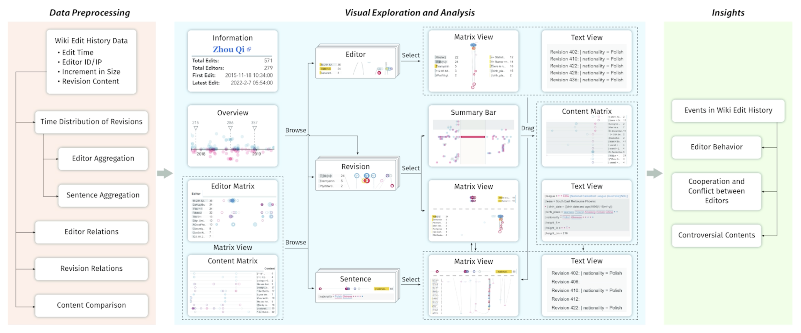
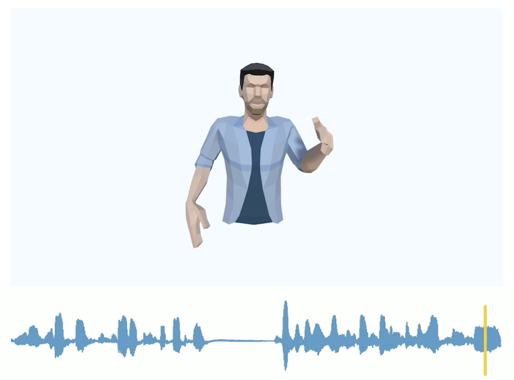

# Education

I'm Yuke Lou, an undergraduate student (expected to graduate in 2023) from Turing Class, School of Electronics Engineering and Computer Science (EECS), Peking University.

# Research Experience
Currently, I'm conducting research at [Visual Computing And Learning (VCL) lab](http://vcl.pku.edu.cn/index.html) under the supervision of [Prof. Baoquan Chen](https://scholar.google.com/citations?user=iHWtrEAAAAAJ&hl=zh-CN) and [Prof. Libin Liu](https://scholar.google.com/citations?hl=zh-CN&user=q7FiLBkAAAAJ). 

For my research interests, I am interested in the intersection of computer graphics and computer vision. In particular, my current research focuses on motion synthesis.

For some of my previous experience:

- Edit-History Vis: An Interactive Visual Exploration and Analysis on Wikipedia Edit History (2021.10 - 2022.4)

  

- Rhythmic Gesticulator: Rhythm-Aware Co-Speech Gesture Synthesis with Hierarchical Neural Embeddings (2021.08 - 2022.5)

  

# Selected Awards
- Merit Student of Peking University 
- 3nd Prize Scholarship of Peking University
- Tianchuang Scholarship
- Social Work Award of Peking University

# Skills

**Languages**: Python, C/C++, C#, JavaScript

# More about me

Wechat official account: Thorin的快乐生活